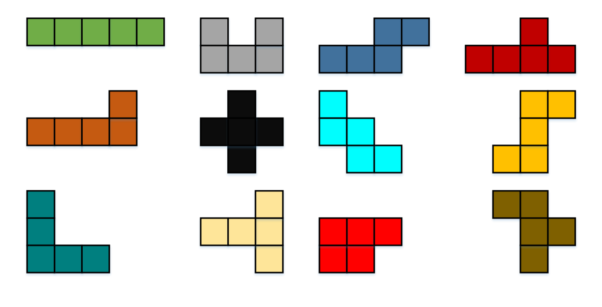
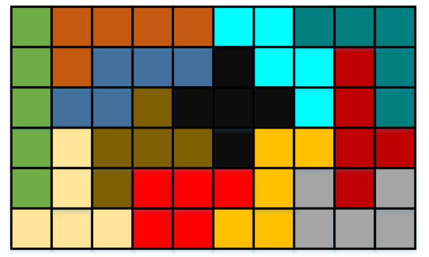
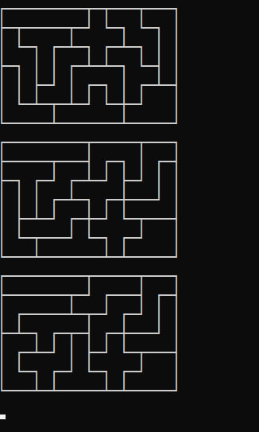

# Puzzle
Filling a rectangle using small tiles! 

## Explanation: 
We have 12 different small tiles: 

There is a 6×10 rectangle which we have to fill using these 12 tiles only by rotating them (not reflecting). 
sample answer: 

The aim is to find all of the possible solutions to the problem.

## How to use: 
Just simply run the code or .exe file 
The answers will be saved in answers.txt

## Result:

